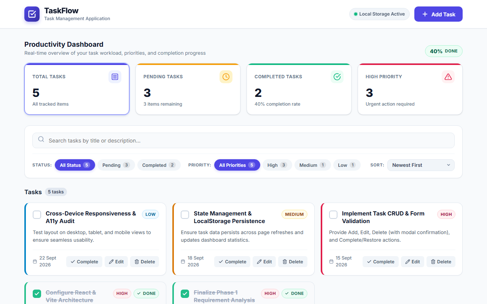
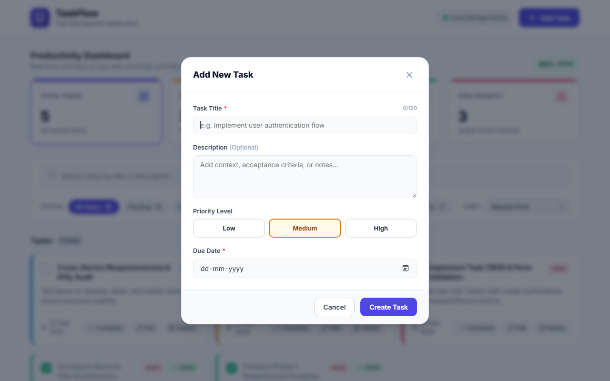
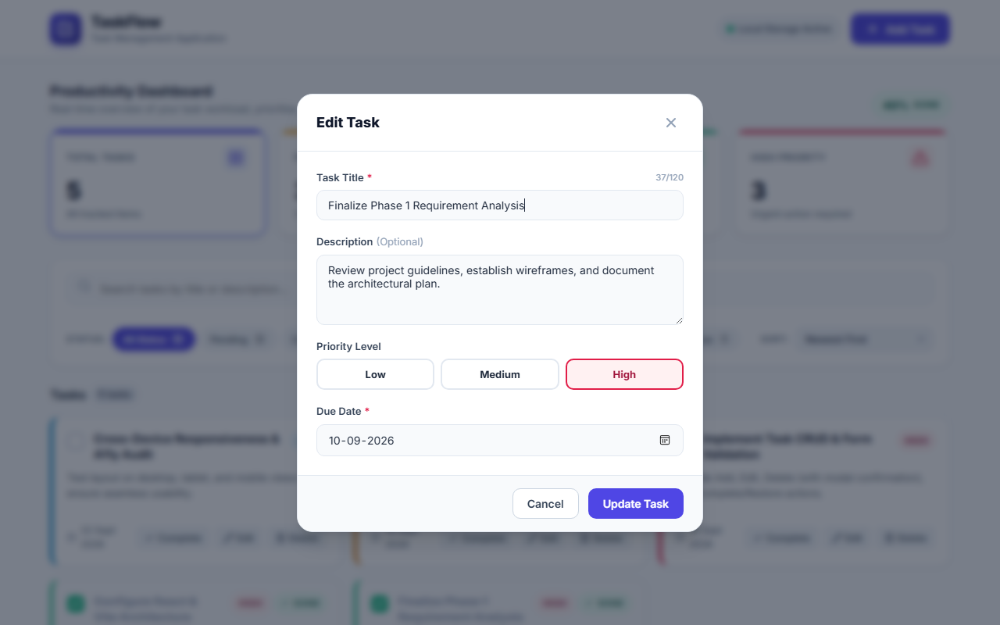
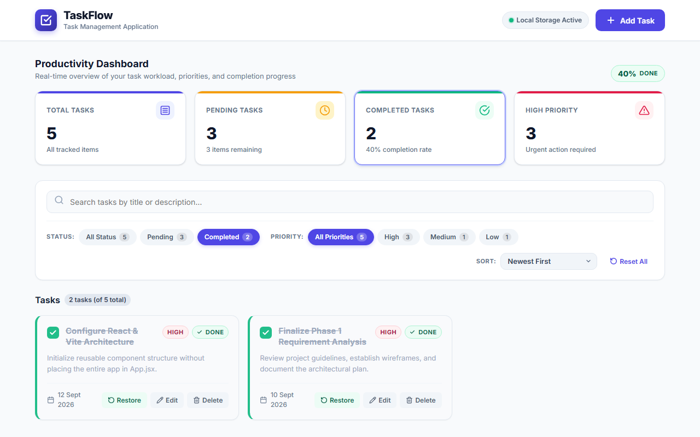
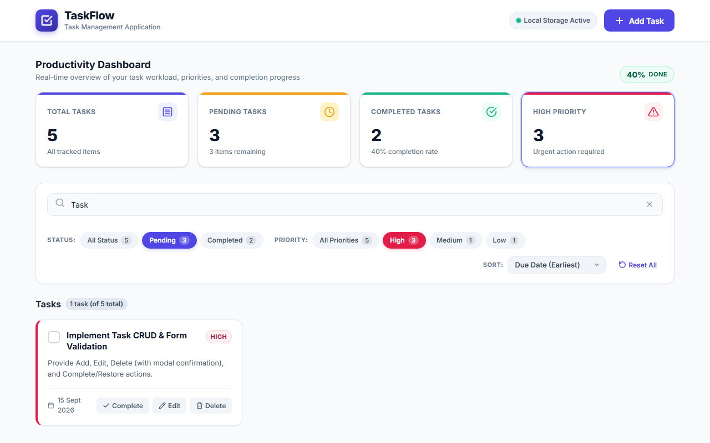
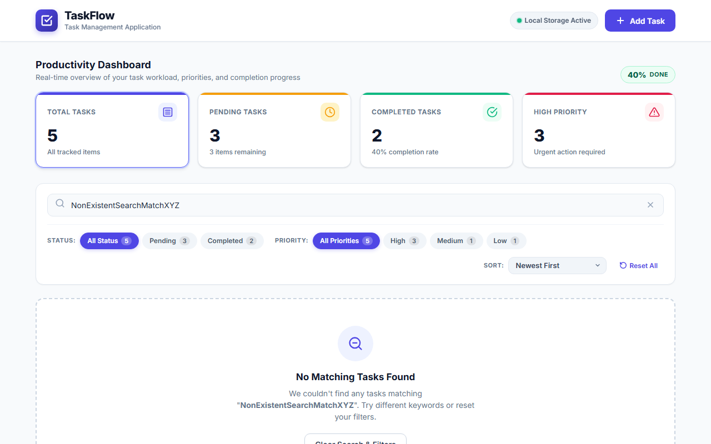
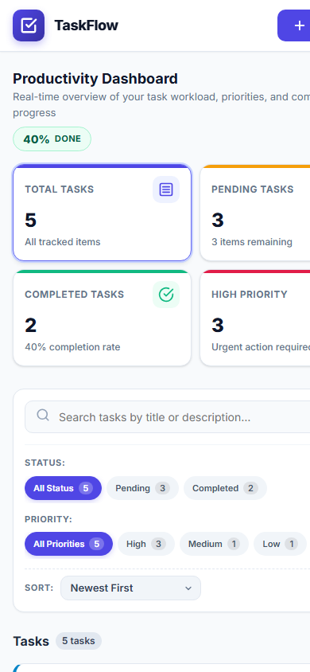

# TaskFlow — Modern Task Management Application (Phase 2)

> **Final Project Submission**: Production-ready, fully responsive, accessible, tested, and optimized Task Management Application built with React 18, Vite 6, and Browser LocalStorage.
>
> 🌐 **Live Demo URL**: [https://chinmaikpoal.github.io/TaskFlow/](https://chinmaikpoal.github.io/TaskFlow/)

---

## 1. Project Title
**TaskFlow — Responsive Client-Side Task Management Application (Phase 2)**

---

## 2. Project Overview
TaskFlow is an intuitive, high-performance Single Page Application (SPA) designed to help individuals and teams organize, prioritize, and track their daily workflows. Upgraded from Phase 1, the Phase 2 release introduces a complete multi-criteria search, filtering, and sorting engine, reactive productivity metrics, due-date status indicators (Overdue, Due Today, Upcoming), non-blocking toast notifications, WCAG AA accessibility compliance, and end-to-end test coverage.

---

## 3. Objectives
- Deliver a robust, serverless task management application that retains 100% of its state offline via HTML5 LocalStorage.
- Provide real-time instant search across titles and descriptions combined simultaneously with status and priority filters.
- Offer dynamic sorting by creation date, deadline, and priority weighting without array mutation or state corruption.
- Deliver an internship-grade UI with micro-interactions, accessible keyboard navigation, and responsive layouts across mobile, tablet, and desktop viewports.
- Maintain a clean, modular React component architecture supported by custom hooks and testable pure utilities.

---

## 4. Phase 1 Features (Preserved & Verified)
All foundational Phase 1 features remain fully functional without regressions:
- **Productivity Dashboard**: 4 live metric counters for Total, Pending, Completed, and High-Priority tasks.
- **Task Creation**: Modal form with Title, Description, Priority selector, and Due Date picker.
- **Task Editing**: Pre-populated modal form modifying existing records with automatic `updatedAt` timestamps.
- **Guarded Deletion**: Modal confirmation dialog with task title preview preventing accidental data loss.
- **Complete & Restore**: Instant completion toggle with strikethrough styling and one-click restoration to pending.
- **Input Validation**: Strict validation requiring non-empty titles and valid calendar due dates.
- **Local Storage Sync**: Automatic serialization and hydration across page refreshes.
- **Contextual Empty States**: Tailored empty views for new users, zero search matches, and no completed items.
- **Responsive Design**: Responsive layout adapting across desktop, tablet, and mobile screens.

---

## 5. Phase 2 Features (New Deliverables)
- **Advanced Multi-Criteria Engine**: Search, status filter, priority filter, and sort selector operating together simultaneously.
- **Custom React Hook (`useLocalStorage`)**: Centralized, robust local storage synchronization with error handling and fallback defaults.
- **Modular Utility Layer**: Pure, decoupled modules for `taskFilters.js`, `taskSorting.js`, and `taskValidation.js`.
- **Due-Date Intelligence**: Real-time visual status badges: **Overdue** (rose-red tag), **Due Today** (amber tag), and **Upcoming / Due Tomorrow** (indigo tag). Completed tasks never display overdue warnings.
- **Non-Blocking Toast Notifications**: Auto-dismissing feedback alerts for task creation, edits, completion, restoration, and deletion.
- **Interactive Dashboard Quick Filters**: Clickable metric cards with visual active rings that filter the task list.
- **Accessibility & Keyboard Navigation**: Full WCAG AA color contrast, visible `:focus-visible` focus rings, semantic markup, and ARIA labels.
- **Automated Test Suite**: 24 automated unit and integration tests executing with `npm test`.

---

## 6. Search, Filter & Sorting Engine
TaskFlow implements a unified pipeline that derives the visible task list from the master state without mutating original data:
1. **Search**: Case-insensitive substring matching against both `title` and `description` updating on every keystroke.
2. **Status Filter**: `All Status`, `Pending`, and `Completed` with dynamic item count badges.
3. **Priority Filter**: `All Priorities`, `High`, `Medium`, and `Low` with color-coded badges and counts.
4. **Sorting Modes**:
   - `Newest First`: Sorts newest `createdAt` timestamp first.
   - `Oldest First`: Sorts oldest `createdAt` timestamp first.
   - `Due Date (Earliest)`: Sorts earliest calendar due dates first (tasks without dates placed at the end).
   - `Priority (High → Low)`: Orders by High (3) → Medium (2) → Low (1).
5. **Reset Action**: One-click "Reset All" button that restores search query, active filters, and sorting to default values.

---

## 7. Productivity Dashboard
- **Total Tasks**: Count of all tracked tasks.
- **Pending Tasks**: Incomplete tasks requiring attention.
- **Completed Tasks**: Finished tasks with overall completion rate percentage (`X% DONE`).
- **High Priority Tasks**: Urgent tasks flagged for immediate action.
- All metrics recalculate reactively upon every Add, Edit, Delete, Complete, or Restore operation.
- Clicking any card filters the visible task list accordingly with active highlight rings.

---

## 8. UX Improvements & Micro-Interactions
- **Visual Feedback**: Subtle hover elevations (`translateY(-2px)` and smooth box-shadow expansions) on cards, buttons, and filter pills.
- **Button States**: Dedicated visual styles for Default, Hover, Active, Disabled, and Focused states.
- **Completed Task Polish**: Strike-through title styling, muted description opacity, green checkmark icon, and clear "Restore" button.
- **Delete Modal Safeguard**: Dialog overlay with warning icon, explanatory copy, and full title preview.
- **Toast Alerts**: Non-blocking notifications with slide-up animations and distinct status colors (Green = Success, Blue = Info, Red = Danger).

---

## 9. Accessibility (A11y)
- **Semantic Structure**: Built with `<header>`, `<main>`, `<section>`, `<article>`, `<button>`, and `<label>`.
- **Form Controls**: All inputs explicitly bound to `<label htmlFor="...">` with `aria-required`, `aria-invalid`, and `aria-describedby` error announcements.
- **Keyboard Navigation**: Complete tab sequence across all interactive buttons, filter pills, inputs, and modals.
- **Keyboard Traps & Shortcuts**: Modals dismiss on `Escape` key and close on outside backdrop clicks.
- **Focus Indicators**: 2px high-contrast focus rings via `:focus-visible` without default browser outline clipping.
- **Color Contrast**: All text, status pills, and badges meet or exceed WCAG 2.1 AA contrast requirements.

---

## 10. Testing Summary
- **Test Runner**: Node.js test suite in `scripts/test-runner.js` executing with `npm test`.
- **Results**: **24 PASSED / 0 FAILED** (100% Pass Rate).
- **Coverage**:
  - Task validation constraints.
  - Search by title and description.
  - Status and priority filtering.
  - Sorting algorithms (Newest, Oldest, Due Date, Priority).
  - Combined multi-filter and sort pipeline.
  - Duplicate task handling and ID generation.
  - Deletion state synchronization.
  - High-volume stress testing (1,000 tasks).
- Full details documented in [`docs/PHASE_2_TEST_REPORT.md`](./docs/PHASE_2_TEST_REPORT.md) and [`docs/TEST_REPORT.md`](./docs/TEST_REPORT.md).

---

## 11. Edge-Case Testing
Detailed in [`docs/EDGE_CASES.md`](./docs/EDGE_CASES.md):
1. **Empty Task Title**: Blocked by form validator and inline error displayed.
2. **Very Long Task Title (>120 chars)**: Handled via `maxLength={120}` and CSS `word-break: break-word`.
3. **Duplicate Tasks**: Prevented key collisions by assigning cryptographically safe unique composite IDs.
4. **Zero Search Results**: Dedicated `EmptyState` displaying search query and "Clear Search & Filters" CTA.
5. **Deleted Task State**: Removed immutably; counters and localStorage sync immediately.
6. **Invalid Calendar Date**: Validated format and calendar boundaries (e.g. February 31 rejected).
7. **Large Task Lists (1,000 tasks)**: Processed in 0.76ms with zero UI freeze.

---

## 12. Optimization Summary
- **Component Memoization**: `TaskCard`, `StatsCard`, `TaskList`, `Dashboard`, and `EmptyState` wrapped with `React.memo` to eliminate unnecessary re-renders.
- **Callback Stability**: All CRUD handlers stabilized with `useCallback`.
- **Optimized Derivations**: Metrics and filtered/sorted lists derived via `useMemo` in a single pass.
- **Zero Heavy Dependencies**: Pure React 18 and standard CSS; no heavy UI libraries or bloated utility packs.
- **Production Bundle**: Bundled in 1.62 seconds via Vite 6 into an optimized gzipped asset size of ~55KB.

---

## 13. Technologies Used
- **Frontend Framework**: React 18.3.1 (Hooks, Functional Components, Context-free modular state)
- **Build Tool & Dev Server**: Vite 6.2.0 (ESM, Fast HMR, Rollup production bundler)
- **Styling**: Native CSS3 (CSS Custom Properties, Flexbox, Grid, Media Queries, CSS Transitions)
- **Typography**: Inter System Font Stack
- **Persistence**: HTML5 Web Storage API (`localStorage`)
- **Automated Testing**: Node.js `node:assert` Test Runner
- **Automated Visual Capture**: Headless Chromium (`msedge`)

---

## 14. Folder Structure
```
TaskFlow/
│
├── public/
│   └── favicon.svg                     # SVG TaskFlow logo favicon
│
├── src/
│   ├── components/
│   │   ├── Header.jsx                  # Brand header & Add Task button
│   │   ├── Dashboard.jsx               # Productivity dashboard metrics
│   │   ├── StatsCard.jsx               # Metric card with interactive filter
│   │   ├── TaskList.jsx                # Responsive task grid & empty states
│   │   ├── TaskCard.jsx                # Task card with badges, dates & actions
│   │   ├── TaskForm.jsx                # Modal form for Add/Edit with validation
│   │   ├── SearchBar.jsx               # Live search input with clear trigger
│   │   ├── FilterBar.jsx               # Status & priority pills + sort select
│   │   └── EmptyState.jsx              # Context-aware empty state graphics
│   │
│   ├── hooks/
│   │   └── useLocalStorage.js          # Custom hook for safe localStorage sync
│   │
│   ├── utils/
│   │   ├── taskFilters.js              # Combined search and filter logic
│   │   ├── taskSorting.js              # Multi-criteria sorting functions
│   │   └── taskValidation.js           # Strict task schema validation
│   │
│   ├── App.jsx                         # Main app component & state derivation
│   ├── main.jsx                        # React root entry point
│   └── styles.css                      # Design system & responsive styles
│
├── docs/
│   ├── PHASE_1_SUMMARY.md              # Phase 1 architecture & baseline features
│   ├── PHASE_2_REQUIREMENTS.md         # Requirements traceability matrix (W5-W8)
│   ├── TEST_REPORT.md                  # Testing summary & overview
│   ├── PHASE_2_TEST_REPORT.md          # Comprehensive test cases & logs
│   ├── EDGE_CASES.md                   # Defensive engineering breakdown
│   └── FINAL_DEMO.md                   # 11-step interactive evaluation flow
│
├── screenshots/
│   ├── dashboard.png                   # Productivity dashboard view
│   ├── add-task.png                    # Add task modal dialog
│   ├── edit-task.png                   # Edit task modal dialog
│   ├── completed-task.png              # Completed tasks view
│   ├── search-filter-sort.png          # Active search, filter & sort view
│   ├── empty-state.png                 # No search results empty state
│   └── mobile-view.png                 # Mobile 390px viewport layout
│
├── scripts/
│   ├── test-runner.js                  # Automated unit/integration test suite
│   └── capture-screenshots.js          # Headless browser screenshot generator
│
├── index.html                          # HTML5 template
├── package.json                        # Scripts and dependencies
├── package-lock.json                   # Deterministic dependency lock
├── vite.config.js                      # Vite bundler configuration
├── wireframe.html                      # Phase 1 wireframe prototype
├── WIREFRAME_PLAN.md                   # Phase 1 wireframe specification
└── README.md                           # Master project documentation
```

---

## 15. Installation
Ensure **Node.js** (v18.0.0 or higher) and **npm** are installed:
```bash
# Clone the repository
git clone https://github.com/Chinmaikpoal/TaskFlow-Phase1.git

# Navigate into the project directory
cd TaskFlow-Phase1

# Install project dependencies
npm install
```

---

## 16. How to Run
```bash
# Start Vite development server
npm run dev

# Run automated test suite
npm test

# Build for production
npm run build

# Preview production build locally
npm run preview
```

---

## 17. How to Use
1. **View Overview**: Inspect the Dashboard to assess current task volume, pending deadlines, and completion rate.
2. **Add a Task**: Click `+ Add Task`, input the title, optional description, priority, and due date, then click `Create Task`.
3. **Filter & Search**:
   - Type in the search input to match keywords in real time.
   - Click status pills (`Pending`, `Completed`) or priority pills (`High`, `Medium`, `Low`) to refine results.
4. **Sort Tasks**: Select an ordering option (`Newest First`, `Oldest First`, `Due Date`, `Priority`) from the Sort dropdown.
5. **Complete / Restore**: Click the circular checkbox on a card to mark it Done; click `Restore` to revert it to Pending.
6. **Edit / Delete**: Use the `Edit` button to update values, or `Delete` to trigger the confirmation modal.
7. **Reset**: Click `Reset All` in the filter toolbar at any point to restore default views.

---

## 18. Screenshots

| View | Preview |
| :--- | :--- |
| **Dashboard** |  |
| **Add Task Modal** |  |
| **Edit Task Modal** |  |
| **Completed Tasks** |  |
| **Search, Filter & Sort** |  |
| **Empty State** |  |
| **Mobile Layout** |  |

---

## 19. Deployment
TaskFlow is a client-side Single Page Application with zero server runtime dependencies and is ready for one-click deployment:

### Deploy to Vercel
1. Push project to GitHub.
2. Import repository in [Vercel](https://vercel.com).
3. Build Command: `npm run build` | Output Directory: `dist`.

### Deploy to Netlify
1. Connect repository in [Netlify](https://www.netlify.com).
2. Build Command: `npm run build` | Publish Directory: `dist`.

### Deploy to GitHub Pages
1. In `vite.config.js`, set `base: './'`.
2. Build the project: `npm run build`.
3. Deploy the `dist` directory using GitHub Pages actions.

### Pre-Deployment Verification
- `npm run build` passes with zero errors.
- Relative assets resolve without hardcoded localhost assumptions.
- LocalStorage functions seamlessly in production HTTPS environments.

---

## 20. Future Improvements
- **Subtasks & Checklists**: Break down complex tasks into manageable sub-items with progress bars.
- **Drag & Drop Reordering**: Kanban board layout with drag-and-drop column transitions.
- **Task Categories / Tags**: Customizable color-coded tags for organization (e.g. Work, Personal, Bug).
- **Data Export & Import**: JSON/CSV export and import for data backup and portability.
- **Dark Mode Theme**: Built-in dark theme toggle adhering to `prefers-color-scheme`.
