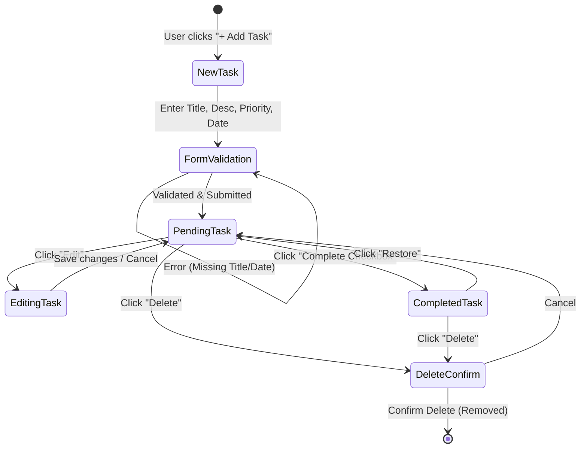
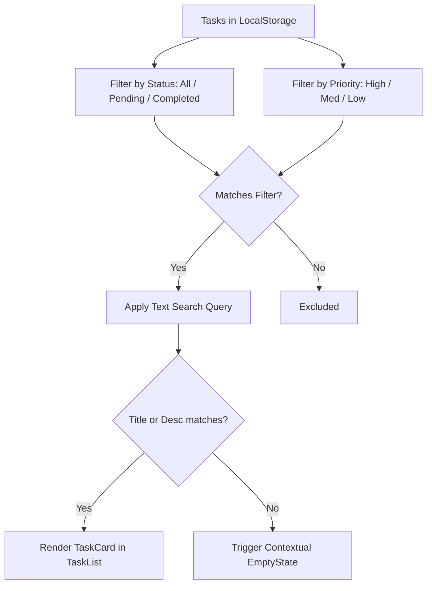

# TaskFlow — Wireframe Plan & UI/UX Architecture (Phase 1)

## 1. Project Overview & Requirements Analysis

**TaskFlow** is an intuitive, responsive frontend application for managing daily tasks and workflows. Phase 1 focuses on core task lifecycle management (CRUD), reactive metric tracking, dynamic search & filtering, and local data persistence without backend dependencies.

### 1.1 Requirements Matrix

| Category | Requirement | Specification / Acceptance Criteria | Status |
| :--- | :--- | :--- | :--- |
| **Core CRUD** | Add Task | Form with Title, Description, Priority (High, Med, Low), Due Date. Title & Due Date required. | Week 3 |
| **Core CRUD** | Edit Task | Form pre-populates existing values, validates changes, and saves in-place immediately. | Week 3 |
| **Core CRUD** | Delete Task | Modal confirmation dialog prevents accidental deletion; deletes immediately on confirmation. | Week 3 |
| **Core CRUD** | Complete Task | Checkbox/toggle marks task as completed with clear visual distinction (strikethrough & faded badge). | Week 3 |
| **Core CRUD** | Restore Task | Easily restore completed tasks back to "Pending" state. | Week 3 |
| **Dashboard** | Reactive Metrics | 4 live statistics: Total Tasks, Pending Tasks, Completed Tasks, High Priority Tasks. | Week 4 |
| **Search** | Instant Search | Real-time substring query across both task title and description fields. | Week 4 |
| **Filter** | Multi-attribute Filters | Quick-filter by Status (All, Pending, Completed) or Priority (High, Medium, Low). Combined with search. | Week 4 |
| **Persistence** | LocalStorage Engine | Auto-saves task collection to browser storage; reloads automatically on browser refresh. | Week 4 |
| **Empty States** | Contextual Feedback | Specific graphic/text feedback for: (1) No tasks exist, (2) No search/filter match, (3) No completed tasks. | Week 4 |
| **UX & A11y** | Accessibility & Polish | Keyboard navigation, explicit form labels, ARIA tags, toast notifications, responsive mobile layout. | Weeks 1–4 |

---

## 2. Feature Checklist (Phase 1 Deliverables)

- [x] **Week 1: Requirement Analysis & UI Planning**
  - [x] Document requirements & feature checklist in `WIREFRAME_PLAN.md`
  - [x] Produce interactive standalone visual wireframe suite in `wireframe.html`
  - [x] Define user flows and screen state transitions
  - [x] Define responsive design breakpoints & layout behaviors
- [x] **Week 2: React Project Setup & UI Development**
  - [x] Initialize Vite + React project structure
  - [x] Build reusable modular components (`Header`, `Dashboard`, `StatsCard`, `TaskList`, `TaskCard`, `TaskForm`, `SearchBar`, `FilterBar`, `EmptyState`)
  - [x] Establish modern, clean CSS design system (`styles.css`)
  - [x] Implement responsive layout (Desktop, Tablet, Mobile)
- [x] **Week 3: Task CRUD Functionality**
  - [x] Add Task with inline validation (Title & Due Date required)
  - [x] Edit Task with pre-populated inputs and live UI update
  - [x] Delete Task with accessible confirmation modal dialog
  - [x] Complete & Restore task state transitions with visual distinction
- [x] **Week 4: State Management & Local Storage**
  - [x] React hooks state architecture (`useState`, `useEffect`, `useMemo`)
  - [x] Automatic LocalStorage synchronization & initialization with sample starter tasks
  - [x] Dashboard metric computations (Total, Pending, Completed, High Priority)
  - [x] Combined Search & Filter logic
  - [x] Dynamic context-aware Empty States
  - [x] Toast notification system for user feedback

---

## 3. Screen & Wireframe Descriptions

### 3.1 Screen 1: Dashboard View
The dashboard greets the user with an overview of their productivity and provides an immediate entry point to create new tasks.
- **Top Header**: Application Logo, branding tag, "Quick Add Task" button, and active status indicator.
- **Metrics Grid**: 4 stat cards arranged horizontally (1x4 on desktop, 2x2 on tablet, 1x1 on mobile):
  1. **Total Tasks** (Indigo theme)
  2. **Pending Tasks** (Amber/Warning theme)
  3. **Completed Tasks** (Emerald/Success theme)
  4. **High Priority Tasks** (Rose/Danger theme)

```
+-------------------------------------------------------------------------------+
|  [Logo] TaskFlow              [+ Add New Task]  [Live LocalStorage Active]   |
+-------------------------------------------------------------------------------+
|  DASHBOARD METRICS                                                           |
|  +---------------+  +---------------+  +---------------+  +---------------+   |
|  |  TOTAL TASKS  |  | PENDING TASKS |  | COMPLETED     |  | HIGH PRIORITY |   |
|  |      08       |  |      05       |  |      03       |  |      02       |   |
|  +---------------+  +---------------+  +---------------+  +---------------+   |
+-------------------------------------------------------------------------------+
```

### 3.2 Screen 2: Task Section (Search, Filters, & Task List)
The central working area allowing users to explore, organize, and act upon tasks.
- **Controls Bar**:
  - Full-width search bar with real-time text matching and clear button.
  - Segmented filter pills: `[All]` `[Pending]` `[Completed]` `[High]` `[Medium]` `[Low]`.
  - Task count indicator showing `Showing X of Y tasks`.
- **Task Grid / List**: Responsive multi-column layout of Task Cards.

```
+-------------------------------------------------------------------------------+
|  [ Search by title or description...                     (Q) ]                |
|  Filters: [ All (8) ] [ Pending (5) ] [ Completed (3) ] | [ High ] [ Med ] [ Low ]
+-------------------------------------------------------------------------------+
|  TASKS (Showing 5 Pending)                                                   |
|                                                                               |
|  +-------------------------------------+  +---------------------------------+ |
|  | [O] Finalize API Specs       [HIGH] |  | [O] Update Documentation  [MED] | |
|  | Draft OpenAPI 3.0 specification for |  | Refresh getting-started guides  | |
|  | authentication & user endpoints     |  | with updated installation steps | |
|  | Due: Sep 15, 2026   [Edit] [Delete] |  | Due: Sep 18, 2026 [Edit] [Delete] |
|  +-------------------------------------+  +---------------------------------+ |
+-------------------------------------------------------------------------------+
```

### 3.3 Screen 3: Add Task Form (Modal Dialog)
An accessible modal overlay with keyboard focus trapping, backdrop click-to-close, and form validation.
- **Inputs**:
  - `Title *`: Text input with error message if empty.
  - `Description`: Multi-line textarea for contextual task details.
  - `Priority`: Segmented radio buttons or styled select (`High` (Red), `Medium` (Yellow), `Low` (Blue)).
  - `Due Date *`: HTML5 Date picker with validation.
- **Actions**: `[Cancel]` and `[Create Task]`.

```
+---------------------------------------------------------------+
|                     CREATE NEW TASK                       [X] |
+---------------------------------------------------------------+
| Task Title *                                                  |
| [ Enter task title...                                       ] |
|                                                               |
| Description                                                   |
| [ Provide details, links, or context for this task...       ] |
| [                                                           ] |
|                                                               |
| Priority Level                                                |
| ( ) Low       ( ) Medium       (*) High                       |
|                                                               |
| Due Date *                                                    |
| [ YYYY-MM-DD                                              V ] |
|                                                               |
| ------------------------------------------------------------- |
|                                 [ Cancel ]  [ + Create Task ] |
+---------------------------------------------------------------+
```

### 3.4 Screen 4: Edit Task Form (Modal Dialog)
Identical structure to the Add Task modal, but pre-populated with current values, dynamic heading ("Edit Task"), and an "Update Task" primary button.

### 3.5 Screen 5: Empty States
Tailored empty state views with descriptive icons, headers, explanations, and direct call-to-actions:
- **No Tasks in System**: "No tasks created yet. Stay organized by adding your first task!" -> `[+ Create Your First Task]`.
- **No Search / Filter Matches**: "No tasks match your criteria. Try adjusting your search query or active filter." -> `[Reset Filters]`.
- **No Completed Tasks**: "No completed tasks yet. Finish your pending tasks to see them celebrated here!"

```
+---------------------------------------------------------------+
|                                                               |
|                         [ Empty Icon ]                        |
|                     No Matching Tasks Found                   |
|         We couldn't find any tasks matching your filters.     |
|                     Try clearing your search.                 |
|                                                               |
|                      [ Clear Search & Filters ]               |
|                                                               |
+---------------------------------------------------------------+
```

### 3.6 Screen 6: Mobile View (< 640px)
- **Header**: Compact header with brand logo and floating action button (FAB) or full-width button.
- **Metrics**: 2x2 compact grid or carousel with readable counts.
- **Filters**: Horizontally scrollable pill bar with touch-friendly tap targets (minimum 44x44px).
- **Cards**: Single-column vertical stack with optimized touch actions (tap to complete, swipe or action icons).
- **Modals**: Bottom-sheet style or full-screen modal ensuring mobile virtual keyboards do not obscure inputs.

---

## 4. User Flows & State Transitions

### 4.1 Complete Task Lifecycle Diagram



### 4.2 Search & Filter Flow


---

## 5. Responsive Design Plan

| Breakpoint | Devices | Layout Strategy |
| :--- | :--- | :--- |
| **Desktop (`>= 1024px`)** | Laptops, Desktop monitors | Multi-column grid (4-col dashboard metrics, 2-3 col task grid). Side-by-side search and filters. Centered floating modal with backdrop blur. |
| **Tablet (`640px - 1023px`)** | iPads, Tablets, Foldables | 2-column metrics grid. 2-column task card grid. Stacked search bar above filter pills. |
| **Mobile (`< 640px`)** | Smartphones (iOS/Android) | 1-column layout. Compact stats cards. Horizontally scrolling filter bar. Full-width touch-friendly task cards. Bottom-sheet modal presentation. |

---

## 6. Design System Specifications
- **Color Palette**:
  - Background: Slate 50 (`#F8FAFC`) with card surface White (`#FFFFFF`).
  - Primary Brand: Deep Indigo (`#4F46E5`, hover: `#4338CA`).
  - Priority High: Crimson / Rose (`#E11D48`, bg: `#FFE4E6`).
  - Priority Medium: Amber / Orange (`#D97706`, bg: `#FEF3C7`).
  - Priority Low: Sky Blue (`#0284C7`, bg: `#E0F2FE`).
  - Completed: Emerald Green (`#059669`, bg: `#D1FAE5`).
  - Borders & Dividers: Slate 200 (`#E2E8F0`).
  - Text Primary: Slate 900 (`#0F172A`), Text Secondary: Slate 500 (`#64748B`).
- **Typography**: Inter (System fallback: `-apple-system, BlinkMacSystemFont, "Segoe UI", Roboto, sans-serif`).
- **Target Touch Sizes**: Minimum 44px for primary action buttons on touch devices.
